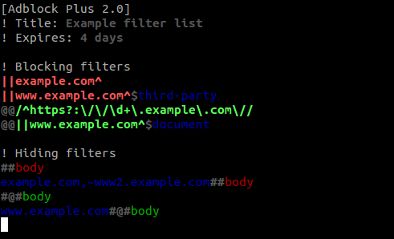

# Adblock Plus Filter List syntax

VIM syntax definition and color scheme for [Adblock Plus filter lists][abp].

## Installation

### Use prebuilt files

- VIM
    - Copy `vim/ftdetect/abp.vim` into `~/.vim/ftdetect` directory.
    - Copy `vim/syntax/abp.vim` into `~/.vim/syntax` directory.

[abp]: https://adblockplus.org/en/filters
